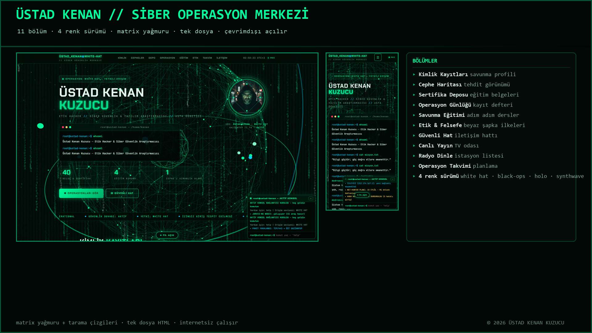
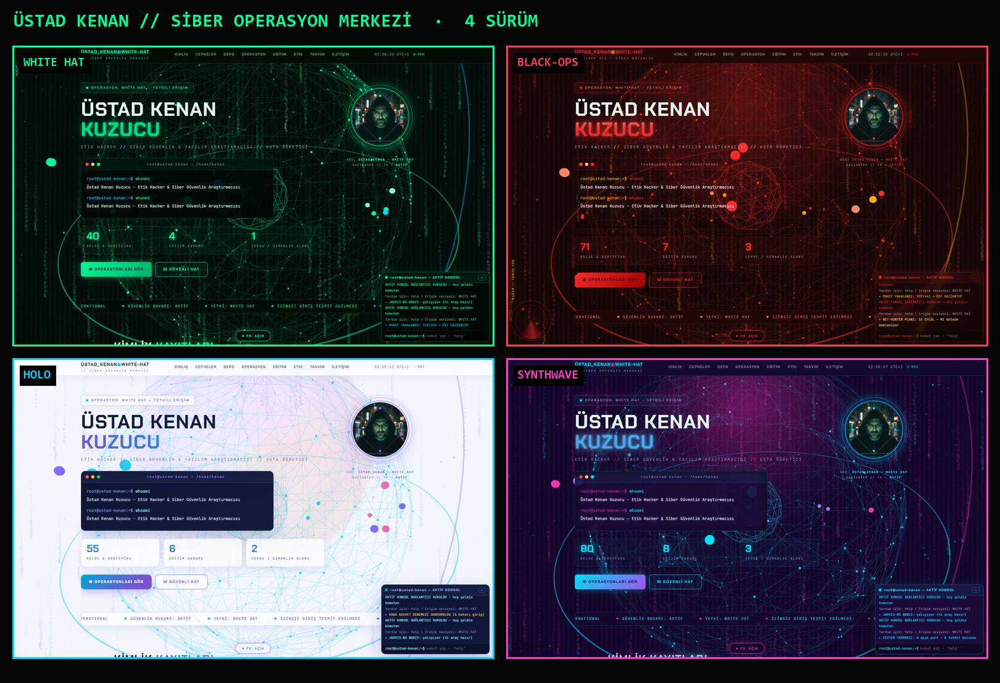
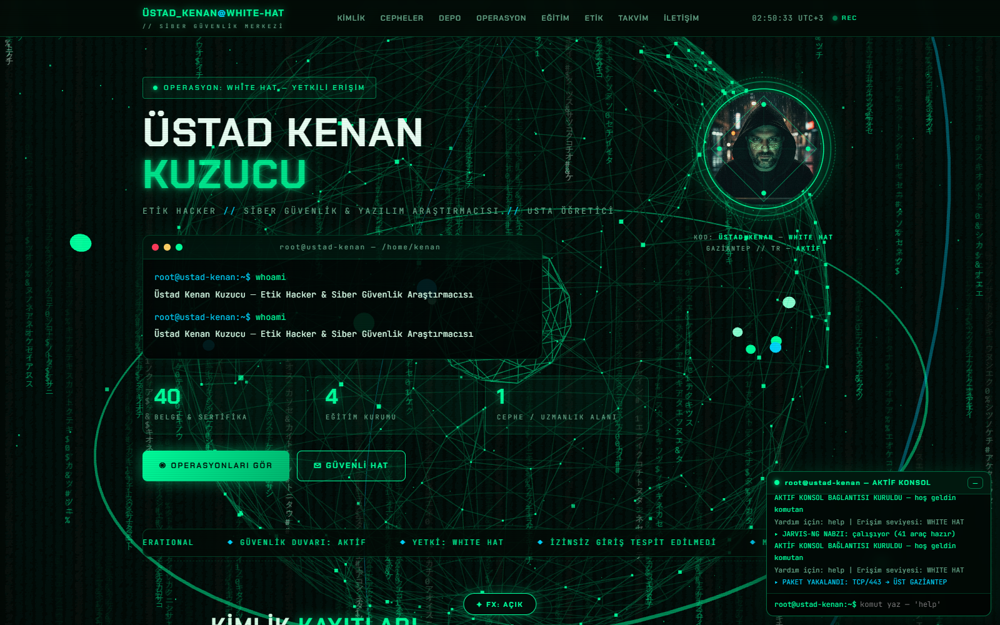
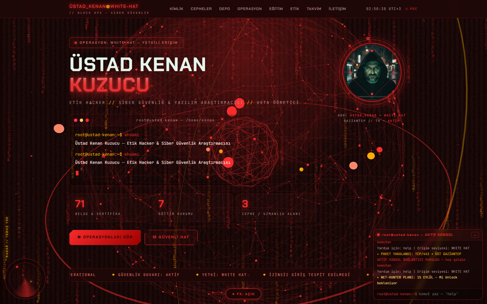
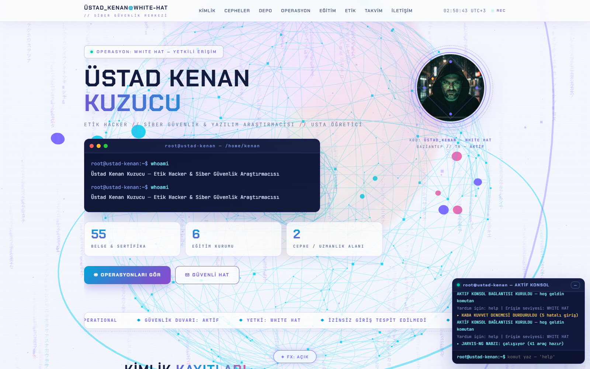
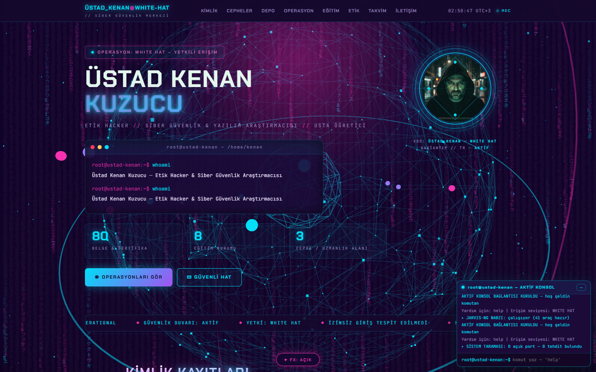

# 🟩 ÜSTAD KENAN // SİBER OPERASYON MERKEZİ

**Beyaz şapka (white hat) siber savunma paneli — matrix yağmurlu, tek dosya.**
11 bölüm, 21 kart ve **4 ayrı renk sürümü**: White Hat · Black‑Ops · Holo · Synthwave.



---

## 📌 Bu depo nedir?

`ÜSTAD KENAN // Siber Operasyon Merkezi` sitesinin **tam kaynak yedeği**. Site tek bir `index.html`
dosyasından oluşur; yanında yalnız kendi fotoğrafı ve bölüm simgeleri vardır. Aynı sayfanın dört renk
sürümü ayrı dosyalar hâlinde durur — hangisini beğenirsen onu yayınlarsın.

| Bilgi | Değer |
|---|---|
| Sürüm | 1.0 (arşiv) · 10 Eylül 2026 üretimi |
| Yapı | Tek dosya HTML + CSS + JS (bağımlılık yok) |
| Bölüm | 11 · kart 21 · düğme 7 |
| Renk sürümü | 4 |
| Efekt | Matrix yağmuru (canvas) + tarama çizgileri |
| Çalışma | Çift tıkla açılır · internetsiz çalışır · sunucu gerekmez |
| Amaç | Savunma amaçlı siber güvenlik eğitimi ve farkındalık |

| Dosya | Boyut | sha256 (ilk 16) |
|---|---|---|
| `index.html` (WHITE HAT) | 103.918 bayt | `398418dbe762441f` |
| `Ustad-Kenan-Cyber-BlackOps.html` | 107.846 bayt | `bb43e2cede8eaf55` |
| `Ustad-Kenan-Cyber-Holo.html` | 105.565 bayt | `860063a4de64ddd7` |
| `Ustad-Kenan-Cyber-Synthwave.html` | 105.728 bayt | `08a13fee048dca94` |

---

## 🎨 Dört sürüm — aynı panel, dört renk düzeni



| Sürüm | Renk | Dosya | Hissi |
|---|---|---|---|
| **WHITE HAT** | matris yeşili | `index.html` | klasik beyaz şapka, sakin ve okunur |
| **BLACK‑OPS** | kırmızı | `Ustad-Kenan-Cyber-BlackOps.html` | gece operasyonu, yüksek alarm |
| **HOLO** | buz mavisi | `Ustad-Kenan-Cyber-Holo.html` | holografik cam panel |
| **SYNTHWAVE** | fuşya / mor | `Ustad-Kenan-Cyber-Synthwave.html` | 80'ler neon estetiği |

<table>
<tr>
<td width="50%"><b>WHITE HAT</b><br></td>
<td width="50%"><b>BLACK-OPS</b><br></td>
</tr>
<tr>
<td width="50%"><b>HOLO</b><br></td>
<td width="50%"><b>SYNTHWAVE</b><br></td>
</tr>
</table>

---

## 🧭 Bölümler (11)

| Bölüm | Ne işe yarar |
|---|---|
| **Kimlik Kayıtları** | Savunma profili: kimlik kartı, görev alanı, yetki seviyesi |
| **Cephe Haritası** | Tehdit görünümü ve durum göstergeleri |
| **Sertifika Deposu** | Eğitim ve başarı belgeleri |
| **Operasyon Günlüğü** | Yapılan işlerin kayıt defteri |
| **Savunma Eğitimi** | Adım adım savunma dersleri |
| **Etik & Felsefe** | Beyaz şapka ilkeleri ve etik kurallar |
| **Güvenli Hat** | Güvenli iletişim hattı |
| **Canlı Yayın** | TV odası |
| **Radyo Dinle** | İstasyon listesi |
| **Operasyon Takvimi** | Planlama ve gün takibi |

Ekran görüntüleri: [Kimlik](ekranlar/06-kimlik.png) · [Cephe](ekranlar/07-cephe.png) ·
[Eğitim](ekranlar/08-egitim.png) · [Canlı yayın](ekranlar/09-yayin.png) · [Radyo](ekranlar/10-radyo.png) ·
[Mobil](ekranlar/11-mobil.png)

---

## ✨ Özellikler

- 🟩 **Matrix yağmuru** — canvas üzerinde akan karakter yağmuru; tüm sürümlerde çalışır.
- 📺 **Tarama çizgileri ve CRT hissi** — eski terminal ekranı görünümü.
- 🪪 **Madalyon** — kenan-avatar.jpg panel başlığında yuvarlak madalyon olarak kullanılır.
- 🎯 **21 kart, 7 düğme** — hepsi kendi simgesi ve kendi rengiyle.
- 📦 **Tek dosya** — kopyala, çift tıkla, açılır; kurulum, sunucu, veritabanı yok.
- 🔌 **Çevrimdışı** — internet yokken de açılır (canlı yayın/radyo için internet gerekir).
- 📱 **Mobil uyumlu** — 430 pikselden masaüstüne kadar tek sütuna iner.
- 🛡 **Savunma odaklı** — içerik eğitim ve farkındalık amaçlıdır; saldırı aracı içermez.

---

## 📁 Klasör yapısı

```
├── index.html                          WHITE HAT sürümü (ana sayfa)
├── Ustad-Kenan-Cyber-BlackOps.html     kırmızı sürüm
├── Ustad-Kenan-Cyber-Holo.html         mavi sürüm
├── Ustad-Kenan-Cyber-Synthwave.html    fuşya sürüm
├── kenan-avatar.jpg                    panel madalyonu
├── ekranlar/                           kapak + 11 ekran görüntüsü (kendi çekimim)
├── kullanici-kareler/IMG_3079.png      kullanıcının kendi ekran görüntüsü (arşiv)
├── belgeler/Siber-Guvenlik-Sitesi-Rehberi.docx   site rehberi
└── ekran-cek.py                        ekran görüntülerini yeniden üreten betik (Chrome + CDP)
```

---

## 🚀 Açma ve yayına alma

**Bilgisayarda:** `index.html` dosyasına çift tıkla.
**Telefonda:** dosyayı telefona kopyala, üzerine dokun.
**cPanel'de yayına almak:** istediğin sürümün dosyasını `index.html` olarak adlandırıp
kök klasöre yükle; `kenan-avatar.jpg` dosyasını da yanına koy. Başka dosya gerekmez.

---

## ⚠️ Dürüst notlar

- Bu, sitenin **erken sürümüdür** (Eylül 2026); `www.ustadcyber.com.tr` üzerindeki güncel sürüm 50 bölümlü
  çok daha geniş bir sürümdür — o sürümün yedeği ayrı depoda: `ustadcyber-com-tr`.
- Canlı yayın ve radyo adresleri yayıncı kuruluşlara aittir; adres değişirse dosya içinden güncellenmelidir.
- Giriş/parola kilidi bu sürümde yoktur; perde ve misafir yetkileri sonraki sürümlerde eklenmiştir.
- Ekran görüntüleri Chrome headless + CDP ile gerçek sayfadan alınmıştır (uydurma görsel yoktur);
  yeniden üretmek için `python ekran-cek.py`.

---

## 👤 Künye

**ÜSTAD KENAN KUZUCU** — beyaz şapka savunma çalışmaları
Gaziantep / Şehitkamil · © 2026 Üstad Kenan Kuzucu

*Bu depo, sitenin tam kaynak yedeğidir: 4 renk sürümü + ekran görüntüleri + rehber belgesi.*
